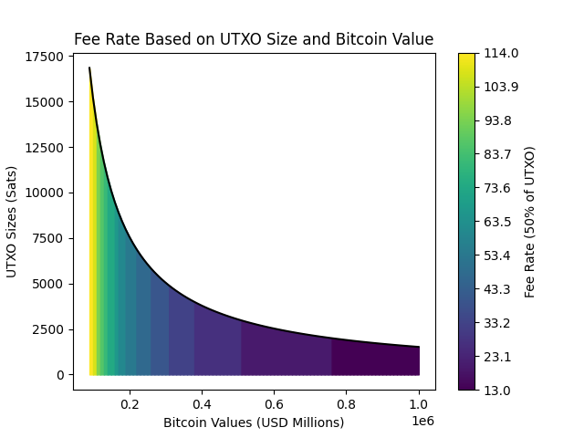
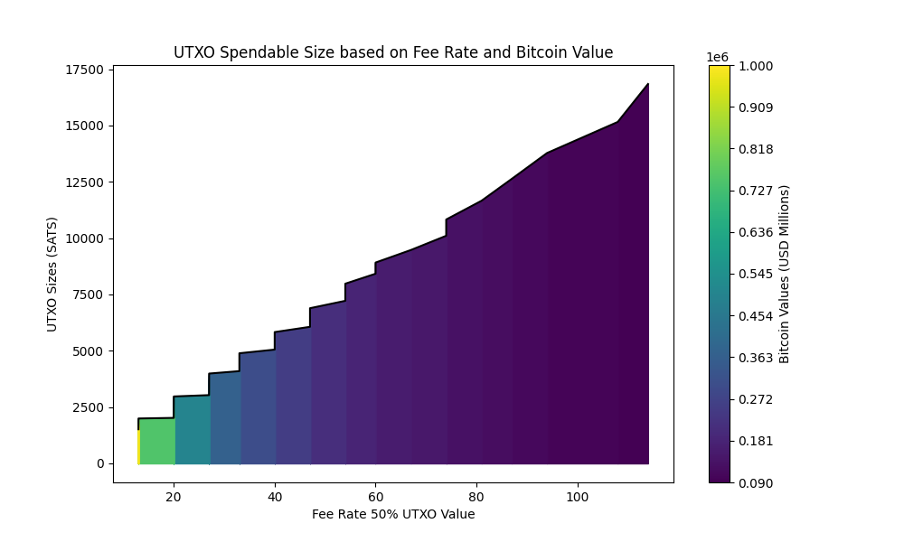

# UTXO Size Model

As the value of bitcoin increases the average individual will inevitablly purchase smaller amounts of Bitcoin at a time leading UTXO's of smaller sizes. Small UTXO's run the risk of becoming unspendable depending on the fee market. Onchain transaction fees are higher percentages of the UTXO when they are smaller amounts. This leads to situations where as the value of Bitcoin rises over time, individuals stack smaller UTXO's, and if the fee market becomes expensive, those UTXO's become unspendable.

Unspendable is a threshold based on the percentage of the UTXO's value (SATS) the owner is willing to spend in order to transact it.

This tool calculates the size in vBytes of a Bitcoin transaction based on:
 - script type (p2pkh, p2sh, p2wpkh, p2wsh, and p2tr )
 - number of inputs
 - number of outputs
 - number of signatures per input
 - number of signatures per output

It takes the transaction size and then uses a value for average monthly spending to act as a dollar cost average (DCA) ammount and computes the UTXO size (SATS) on increasing values of Bitcoin (USD).

The user can then set a threshold percentage indicating how much of the UTXO they are willing to spend in fees to transact the UTXO. Using this data plots can be generated that show the UTXO size and the fee rate that the user would need to stay under in order to be able to transact that utxo within their thresholds.

Below is an example output where the y axis shows the UTXO size in sats, the x axis shows the Bitcoin in USD millions, and the color indicating the fee in sats. These UTXO's are derived from the average monthly savings of an individual in the world about 16 dollars and what their representative UTXO size would be as the valuation of Bitcoin increases. The color indicates the fee rate that the holder would need to stay under in order to meet the threshold specified, in this case 50 percent of the utxo size.

 At Bitcoin priced at 90k dollars or 0.09M, the UTXO size would be around 17,500 sats and the holder would not be able to spend it if fees went over 57 sats/vbyte. At Bitcoin priced at 200k or 0.2M the holder would DCA a utxo size of 5,000 sats and they would need to have fees under 27 sats/vbyte to be able to spend their transaction.

### Transaction Size resources:
- https://bitcoinops.org/en/tools/calc-size/
- https://jlopp.github.io/bitcoin-transaction-size-calculator/
### Global savings data by country:
- https://www.theglobaleconomy.com/rankings/savings_dollars/
gross national income - total consumption + net transfers.

[def]: images/worldAverageMonthly_singleTx.png
[def2]: ./images/worldAverageMonthly.png